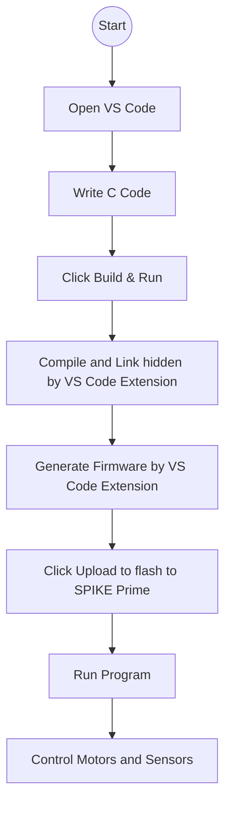

```mermaid
graph TD
start((Start)) --> vscode[Open VS Code]
vscode --> write[Write C Code]
write --> button["Click Build & Run"]

button --> build[Compile and Link hidden by VS Code Extension]
build --> firmware[Generate Firmware by VS Code Extension]
firmware --> flash[Click Upload to flash to SPIKE Prime]
flash --> run[Run Program]
run --> hardware[Control Motors and Sensors]
```
