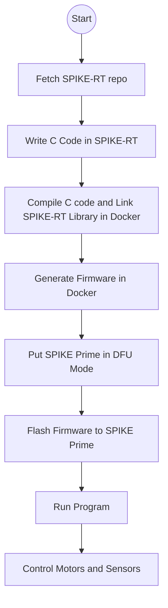

```mermaid
graph TD

start((Start)) --> fetch[Fetch SPIKE-RT repo] --> write[Write C Code in SPIKE-RT]
write --> compile[Compile C code and Link SPIKE-RT Library in Docker]
compile --> firmware[Generate Firmware in Docker]
firmware --> dfu[Put SPIKE Prime in DFU Mode]
dfu --> flash[Flash Firmware to SPIKE Prime]
flash --> run[Run Program]
run --> hardware[Control Motors and Sensors]


```
